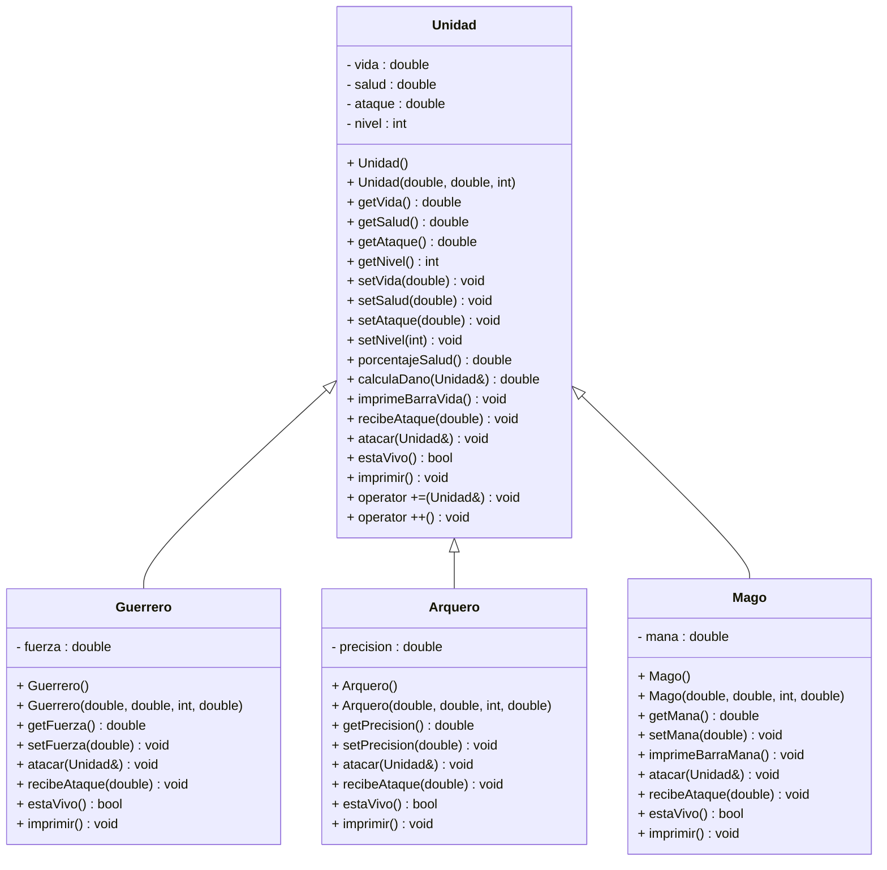

# Evidencia 1 | Proyecto integrador 

## Diagrama de Clase UML

## Documentación Proyecto
Programación orientada a objetos (Gpo 850)

Nombre: Gabriel Enrique Lascurain Flores

Matrícula: A01707236

En este proyecto, nuestro propósito era crear un sistema de clases haciendo uso de la programación orientada objetos
el cual fuese capaz de abstraer y generar un juego donde  pudiesemos crear unidades o combatientes con diferentes
características para posteriormente enfrentarles entre si. Para hacerlo posible hice uso de las nuevas herramientas
aprendidas en este curso, siendo dichos:

La Herencia, para la creación de las mismas unidades, familiarizandolas en aquellas propiedades básicas que compartían y
definiéndolas en clases derivadas para darles distintas características. Llegando así a las unidades de Guerrero, Arquero
y Mago. Compartiendo atributos y creando nuevos propios para cada uno, así como incorporando métodos que a siendo
virtuales en nuestra clase base, definen y vuelven útiles a nuestras clases derivadas. En mi caso siendo las clases
"atacar()" y "estaVivo()", sin las cuales nuestras clases derivadas no podrían concretarse y serían inútiles, como
es lógico con la abstracción y utilidad que le brindaremos a nuestras clases.

El Polimorfismo, se ve en los mismos archivos de clases, donde a partir de los métodos ya creados para la clase base Unidad,
a pesar de esta ser una clase abstracta pura, utilizamos y sobreescribimos dichos métodos en nuestras clases derivadas
para brindarle distintas características a la misma función dependiendo de la clase del objeto en el que se utilice. Siendo
el ejemplo más evidente nuestro método "imprimir()", el cuál se adapta a las clases derivadas, desplegándonos en la terminal
el tipo de clase de nuestro objeto y los datos del mismo. Este mismo lo aprovechamos fuertemente en nuestro archivo main, al
utilizar estos métodos sobre vectores de tipo apuntador a nuestra clase base, permitiéndonos guardar todos nuestros objetos
en un mismo arreglo y aprovechar las propiedades polimórficas de sus métodos y pudiendo hacerlos interactuar entre si.

Por otro lado tenemos la sobrecarga de operadores, siendo un tema bastante nuevo y bastante divertido de usar, donde
realmente tenía muchísima libertad para hacer lo que quisiese, pero opte por facilitarnos la vida a mi y a mi profesora
utilizando el operador "+=" entre dos unidades de combate, o entre dos apuntadores mejor dicho, presentando en la terminal las dos unidades a enfrentar, haciendo uso de sus métodos "imprimir()" de manera polimórfica. Igualmente hice uso del operador "++" como preincremento, que simplemente tiene la utilidad de subir de nivel de manera dinámica a nuestra unidad, tal como esta definido en su setter de Nivel que actualiza sus atributos al subir o bajar de nivel.

Finalmente está el uso de excepciones, sin duda un tema bastante complejo y algo abrumador. Por utilidad en mi código y por simpleza y mi propia salud mental. Opté por hacer uso de la excepción "invalid_argument" de la libreria "<stdexcept>", únicamente (que es muy importante) para asegurar que nuestros constructores por parámetros funcionaran correctamente al ser utilizados por nuestro usuario en la creación de su ejército. El cuál implemente con un "switch" y permitiéndole al usuario crear ahí mismo sus unidades de combate una por una, permitiéndole hacer su ejército tan grande o pequeño como quisiese y asignandole los atributos que quisiese a sus combatientes de la clase que quisiese. Esto lo hice por gusto personal pero igualmente porque se me complicó bastante el implementar la lectura de archivos correctamente, es un tema que solucionaré personalmente pero por el momento estoy muy satisfecho con el resultado de mi proyecto.

En conclusión, me pareció un proyecto muy divertido y un reto apropiado para implementar los temas vistos en este curso. No tengo más que decir, estoy conforme con el resultado de mi proyecto y confiado de haber entendido e implementado los temas nuevos. Me ayudó muchísimo este curso y no requerí de fuentes externas al material brindado por el mismo para la realización de este proyecto y el entendimiento de los temas.

