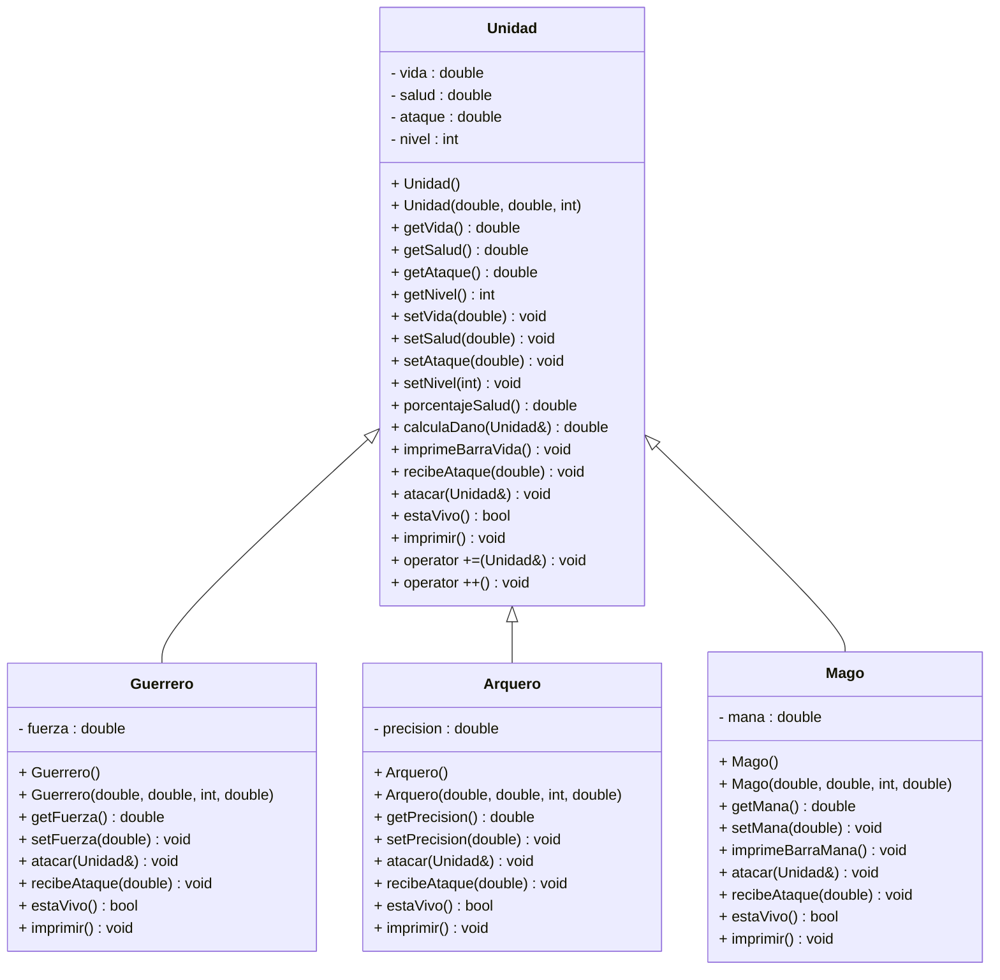

# Evidencia 1 | Proyecto integrador 

## Diagrama de Clase UML



# Proyecto Simulador RPG

Este proyecto es una propuesta para la simulación de un sistema de combate RPG (Role-Playing Game) en el que se modelan diferentes unidades como Arqueros, Guerreros y Magos. Utilizando C++ como lenguaje base, este sistema permite explorar las interacciones entre diferentes personajes en un entorno modular y fácilmente extensible.

## Descripción General

El simulador está diseñado para representar batallas o interacciones estratégicas entre unidades RPG, cada una con habilidades y características únicas. Los personajes están organizados en clases individuales que encapsulan su comportamiento y atributos, fomentando el uso de principios de programación orientada a objetos.

## Funcionalidades Principales

1. **Clases de Personajes**
   - **Arquero**: Especialista en ataques a distancia con alta precisión.
   - **Guerrero**: Unidad de combate cuerpo a cuerpo con alta resistencia.
   - **Mago**: Maestro de hechizos con habilidades ofensivas y defensivas únicas.

2. **Sistema Modular**
   - Cada unidad se implementa como una clase independiente para facilitar su modificación y extensión.
   - Gestión centralizada a través de clases base (`Unidad`) y derivadas (`Arquero`, `Guerrero`, `Mago`).

3. **Interacciones Dinámicas**
   - Simulación de ataques, defensas y habilidades específicas de cada unidad.
   - Escenarios personalizables para probar estrategias.

4. **Makefile Integrado**
   - Automatización del proceso de compilación para facilitar el desarrollo y ejecución del programa.

## Estructura del Proyecto

### Archivos de Código
- `Unidad.hpp` y `Unidad.cpp`: Clase base que define los atributos y métodos comunes a todas las unidades.
- `Arquero.hpp` y `Arquero.cpp`: Implementación de la clase Arquero.
- `Guerrero.hpp` y `Guerrero.cpp`: Implementación de la clase Guerrero.
- `Mago.hpp` y `Mago.cpp`: Implementación de la clase Mago.
- `exercise.cpp`: Programa principal que ejecuta las interacciones entre las unidades.

### Archivo de Configuración
- `makefile`: Archivo para compilar el proyecto con comandos simples.

### Documentación
- `README.md`: Descripción del proyecto y guía de uso.

El **Proyecto Simulador RPG** puede servir como base para:
- Desarrollar videojuegos basados en combate RPG.
- Prototipar mecánicas de combate para juegos más complejos.
- Utilizarlo como recurso educativo en programación orientada a objetos y diseño modular.

## Ejecución del Proyecto

1. Clona el repositorio y navega al directorio del proyecto.
2. Compila el proyecto utilizando el `makefile`:
   ```bash
   make

